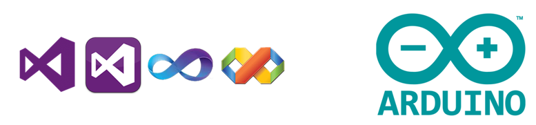
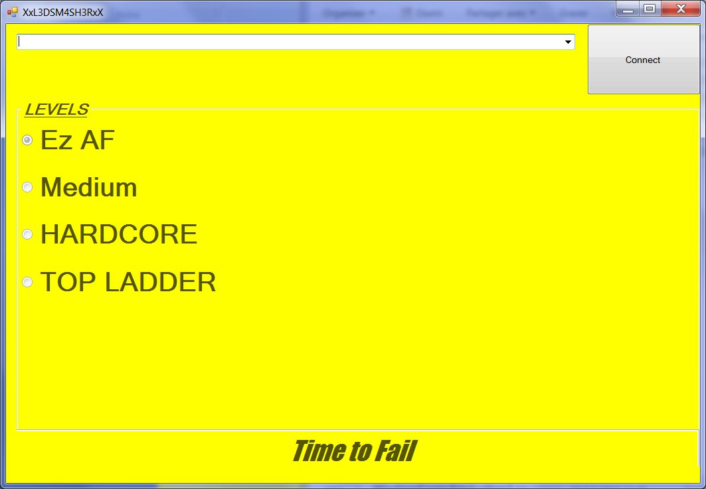

# LedsReflex
Mini projet élèves Arduino+Visual Studio

Réalisé par MAISTRE BAZIN Mathis et TOURRES Hugo
Term STI2D spé SIN
Lycée Alphonse Benoit - L'Isle sur la Sorgue

Professeur : M. SILANUS

# Description
Jeu du type "Tape Taupes" autours d'une carte microcontrôleur Arduino Uno et d'une interface Homme-Machine conçue via Visual Studio :
* diaporama de présentation
* diagramme de séquence (MagicDraw)
* code Arduino 
* projet Visual Studio développé en C#.

# But du jeu
Presser le bouton face à la led allumée. Le joueur à 20 essais et peut choisir le niveau de difficultés.

